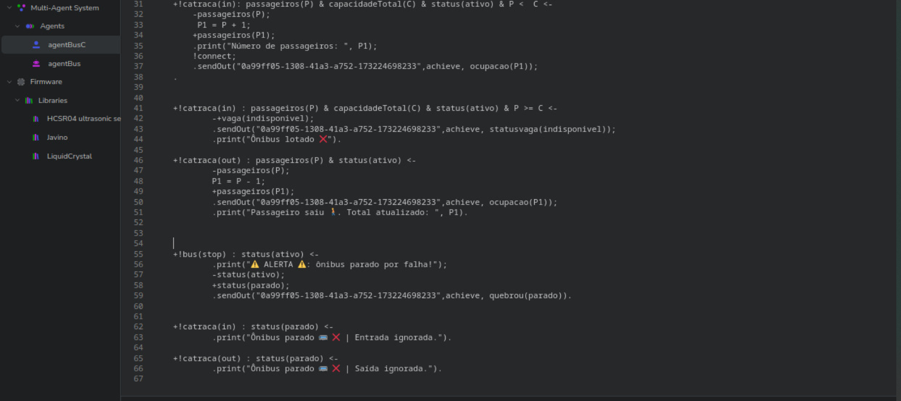
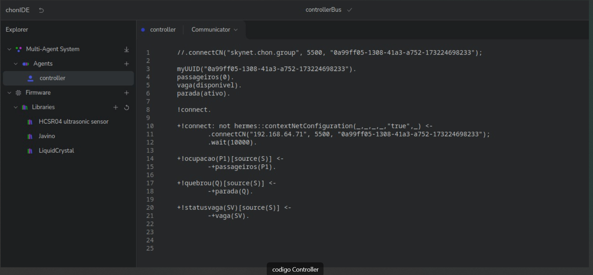
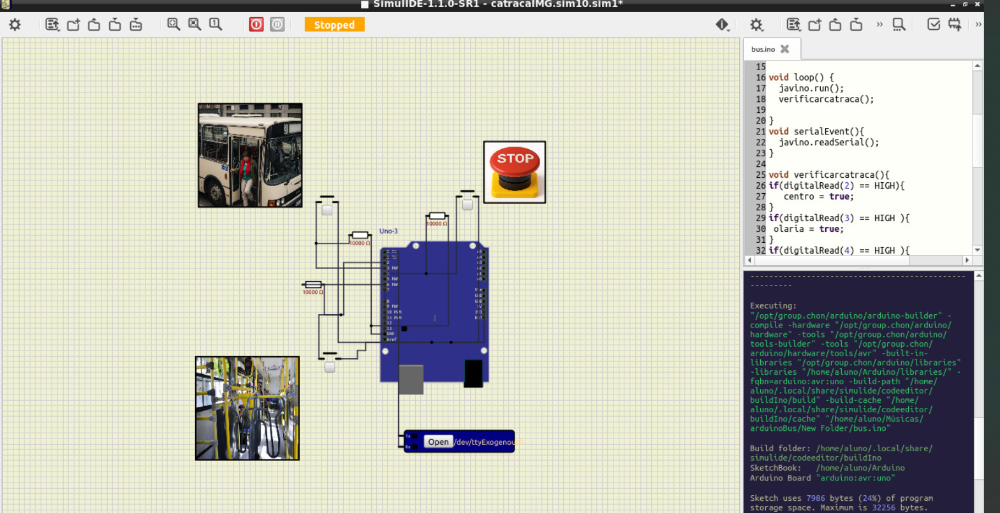

# 🚌 BusAI: Sistema Inteligente de Informação ao Passageiro

Projeto multiagente baseado no modelo BDI, desenvolvido com Jason, Javino e Arduino, com o objetivo de fornecer **informações dinâmicas e confiáveis aos passageiros** sobre localização, ocupação e estado dos ônibus em tempo real.

---

## 🧠 Arquitetura de Agentes

O sistema é composto por três agentes principais:

### 🔵 Agente Ônibus

- Representa um ônibus em tempo real.
- Responsável por enviar:
  - Localização geográfica
  - Lotação atual
  - Status de funcionamento
- Imagem ilustrativa:
  
  

---

### 🟣 Agente Ponto

- Simula o totem da parada de ônibus.
- Interage com o passageiro fornecendo:
  - Tempo estimado de chegada
  - Lotação do próximo veículo
  - Avisos de falhas
- Imagem ilustrativa:
  
  

---

### 🟢 Agente Coordenador

- Garante a consistência das informações entre ônibus e ponto.
- Responsável por:
  - Gerenciar fluxo de dados
- Imagem ilustrativa:
  

---

## 🔧 Tecnologias Utilizadas

- **Jason**: desenvolvimento dos agentes BDI (AgentSpeak(L))
- **Javino**: comunicação com sensores e integração futura com Arduino
- **ChonIDE**: desenvolvimento e depuração dos agentes
- **Arduino**: leitura de sensores (ex: botão de parada, distância, lotação)

---

## 🖼️ Ilustrações do Projeto

- Interações do Bus
  

- Arduino do Agente Bus
  

- Código Arduino do Agente Ponto
  

---

## 🎥 Demonstração em Vídeo

Assista a uma demonstração do projeto em funcionamento no vídeo abaixo:

---

## ⚙️ Funcionamento Geral

O sistema responde ao passageiro da seguinte forma:

1. O passageiro interage com o totem (Agente Ponto)
2. O totem requisita dados do Agente Coordenador
3. O Coordenador consulta os Agentes Ônibus
4. O passageiro recebe informações de:
   - Previsão de chegada
   - Lotação
   - Falhas no veículo

---

## 👨‍💻 Autores

- **Andrei Silva Serafim Wermelinger**
- **Lucas Pontes Lira**

---